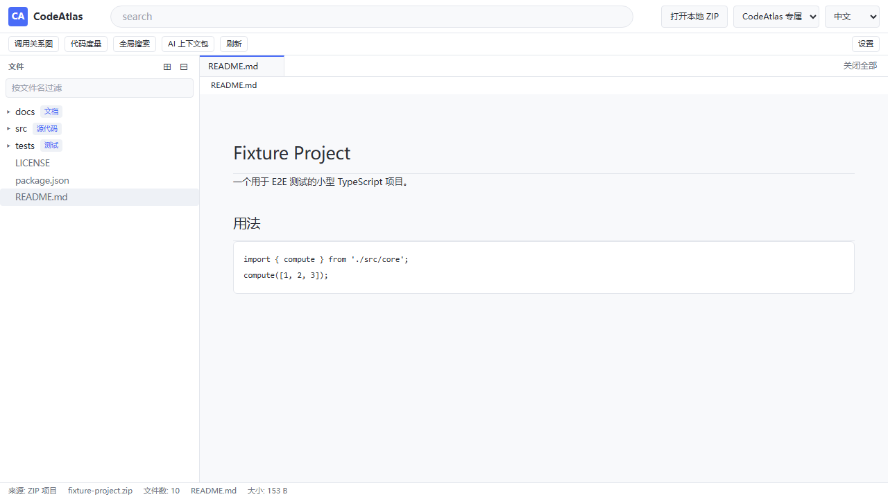
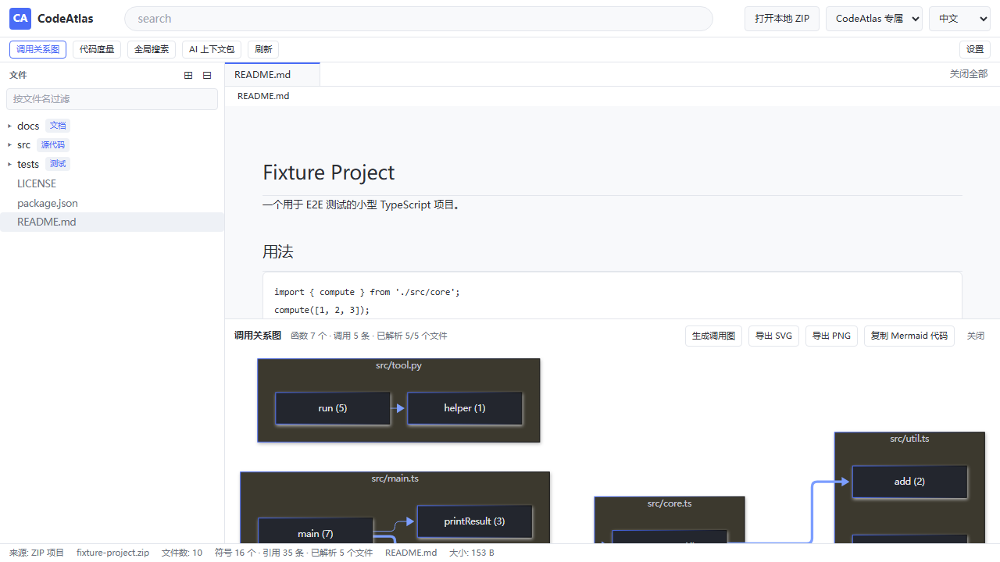
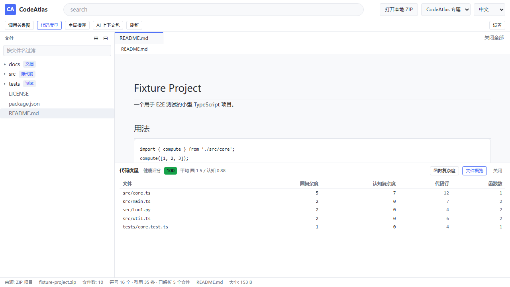
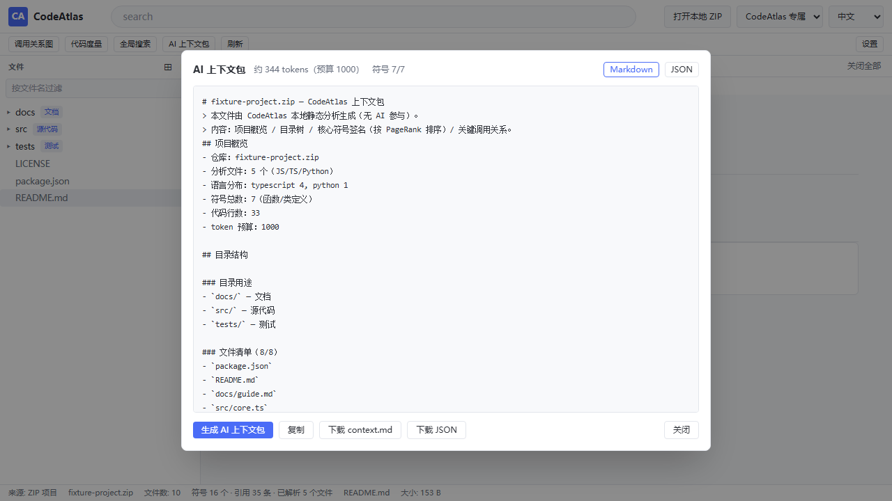

# CodeAtlas（码图）

> 为开发者绘制一张可交互的代码地图：**目录是地形，调用关系是道路，阅读路线是导航，AI 上下文包是给智能助手的旅行指南。**
>
> 完全本地运行 · 免费 · 轻量 · 安全 —— **不调用任何 AI/LLM，不收集任何数据，不上传任何文件。**

[](../../actions/workflows/ci.yml)
[](../../actions/workflows/codeql.yml)
[](LICENSE)
[](../../releases)
[](https://linu-code.github.io/codeatlas/)



## 它解决什么问题

读一个陌生仓库，通常要在浏览器、编辑器、搜索之间反复横跳。CodeAtlas 把"读懂一个项目"需要的五件事放进同一个窗口，并且**全部用确定性静态分析实现**（AST 解析 + 启发式规则 + 模板），因此离线可用、结果可复现、无需任何 API Key：

| 能力 | 说明 | 实现方式 |
|------|------|----------|
| 📁 **文件树导航** | 折叠/展开、按名过滤，**自动标注目录用途**（`src/` → 源代码、`.github/` → CI 配置…） | 30 条规则表 + 内容启发式 |
| 📊 **调用关系图** | 函数级调用图，按文件分组，可导出 SVG / PNG，可复制 Mermaid 代码 | web-tree-sitter AST + 去噪构图 + Mermaid |
| 🧭 **跨文件跳转** | `Ctrl/Cmd+单击` 或 `F12` 转到定义，一键列全部引用（文件:行号） | 自研 scope graph 符号索引 |
| 📈 **代码度量** | 圈复杂度（McCabe）、认知复杂度（SonarSource）、SLOC、健康评分 | **单次 AST 遍历**同时算出全部指标 |
| 🎒 **AI 上下文包** | 一键生成 token 预算内、按重要性排序的符号摘要，喂给 Cursor / Trae / WorkBuddy 等工具 | PageRank + 二分预算裁剪 |

## 截图

| 主界面（Atlas Blue 主题） | 调用关系图 |
|---|---|
|  |  |

| 代码度量 | AI 上下文包 |
|---|---|
|  |  |

> 截图由 E2E 测试自动生成：`npm run e2e` 会把界面截图写入 `docs/screenshots/`。

## 快速开始

### 方式一：直接运行（推荐给使用者）

下载 [Releases](../../releases) 中的 `CodeAtlas_*_x64-setup.exe` 安装，或使用免安装的绿色单文件 `CodeAtlas.exe`。**无需安装 Node.js 或 Rust。**

Windows 10（1803+）/ Windows 11 已内置 WebView2 运行时；更早的系统需装 [WebView2 Runtime](https://developer.microsoft.com/microsoft-edge/webview2/)。

### 方式二：从源码运行

```bash
git clone https://github.com/Linu-code/codeatlas.git
cd codeatlas
npm install

# 浏览器模式（开发用，速度最快）
npm run dev

# 桌面模式（Tauri 窗口，需先装 Rust 工具链，见下）
npm run tauri dev
```

### 方式三：打包成 exe

前置环境（仅构建机需要，**最终用户不需要**）：

```powershell
# 1. Rust（选 MSVC 工具链）
winget install --id Rustlang.Rustup
# 或手动：https://rustup.rs
rustup default stable-x86_64-pc-windows-msvc

# 2. Microsoft C++ 生成工具 + Windows SDK
#    安装 Visual Studio 2022 生成工具，勾选"使用 C++ 的桌面开发"
#    https://visualstudio.microsoft.com/downloads/

# 3. 验证
cargo --version && rustc --version
```

打包：

```bash
npm install
npm run build:exe                      # 产出 exe + NSIS 安装包（推荐，自动注入 MSVC 环境）
npm run build:exe -- -NoBundle         # 只产出免安装绿色 exe（更快）
```

> `npm run build:exe` 会调用 `scripts/build-exe.ps1`：它自动探测 Visual Studio / Windows SDK
> 并注入 `PATH/INCLUDE/LIB`，最后把产物**复制到项目根目录**。直接跑 `npm run tauri build`
> 在本机 PowerShell 会话里会因缺少 `link.exe` 而失败（原因见 `docs/ACCEPTANCE.md`）。

产物位置（根目录下的两份是给用户直接用的，`target/` 里的是 Cargo 原始输出）：

```text
CodeAtlas.exe                              # 免安装绿色版，双击即用
CodeAtlas_<版本>_x64-setup.exe             # NSIS 安装包
src-tauri/target/release/codeatlas.exe                        # Cargo 原始输出（可清理）
src-tauri/target/release/bundle/nsis/*-setup.exe              # Cargo 原始输出（可清理）
```

> 根目录的 exe 已写入 `.gitignore`：二进制不入库，请通过 GitHub Release 分发
> （打 tag 后 `.github/workflows/release.yml` 会自动构建并上传）。

## 使用方式

顶栏命令中心支持三种输入，**输入后回车即可，无需点按钮**：

1. **完整网址**：`https://github.com/facebook/react`（也支持 `.../tree/branch/subdir`）
2. **owner/repo 简写**：`facebook/react`
3. **仓库名搜索**：`react` → 下拉前 10 条（★ 星标 / 描述 / 语言），方向键选择、回车确认、Esc 关闭

另外两种输入源：

- **本地 ZIP**：点顶栏「打开本地 ZIP」，或直接把 `.zip` **拖入窗口** —— 每个 ZIP 会打开一个**独立窗口**，原窗口状态不受影响；拖入非 ZIP 会提示错误。
- **URL 历史**：输入框为空时按 `↑` / `↓` 可调出最近 10 条记录。

### 快捷键

| 快捷键 | 功能 |
|--------|------|
| `Enter` | 加载仓库 / 触发搜索（空输入无响应） |
| `↑` `↓` | 搜索结果导航；空输入时翻历史记录 |
| `Esc` | 关闭搜索下拉 / 关闭面板 |
| `Ctrl/Cmd + 单击` 或 `F12` | 转到定义（选中文本后按 F12 亦可） |
| `Ctrl/Cmd + Shift + F` | 全局正则搜索（Web Worker 执行，10 秒超时自动终止） |

## 技术栈

| 层面 | 选型 | 理由 |
|------|------|------|
| 桌面框架 | **Tauri 2**（Rust + 系统 WebView2） | 体积约 3 MB，冷启动快，不用 Electron |
| 前端 | React 18 + TypeScript + Vite + Tailwind CSS | 类型安全；分析层全为纯函数便于单测 |
| AST 解析 | **web-tree-sitter 0.22** + tree-sitter-wasms（WASM） | 浏览器内真实语法树，支持 JS/TS/TSX/Python |
| i18n | i18next + react-i18next | 命名空间组织，中/英/日，RTL 已预留 |
| 代码高亮 | Prism（语言包按需动态加载） | 首屏只带 4 个核心语法，其余用时再拉 |
| 图表 | Mermaid（动态加载） | 调用图渲染 + SVG/PNG 导出 |
| 本地缓存 | IndexedDB（手写薄封装） | 二次打开秒开；断网回退旧缓存 |
| 测试 | Vitest（115 个单测）+ Playwright（13 个 E2E 用例） | 分析层纯函数全覆盖 |

> **版本锁定说明**：`web-tree-sitter` 必须与语法包 ABI 匹配。项目锁定 `web-tree-sitter@0.22.6` + `tree-sitter-wasms@0.1.13`；0.25+ 运行时改用新版 dylink 段，加载旧 ABI 语法包会报 `getDylinkMetadata` 失败。
>
> **升级路径**：运行时与语法包必须**成对**升级。步骤：① 同时改 `package.json` 里的两个版本并 `npm install`；② 跑 `npm run check:tree-sitter`（会对 js/ts/tsx/python 四种语法包逐个真实解析并打印结果，任一失败即退出非零）；③ 确认 `scripts/copy-grammars.mjs` 里引用的 wasm 文件名仍存在（不同版本文件名不同）；④ 最后 `npm test` 复跑 `tests/unit/{symbols,callgraph,scopeGraph,metrics}.test.ts` 四个依赖真实 AST 的用例。

## 硬性约束（设计红线）

- 🚫 **零 AI**：不调用任何 LLM / AI API / 本地模型，"智能解读"全部来自确定性静态分析与模板
- 🔒 **零上传**：不收集数据、不上传文件，ZIP 解压前校验路径（拒绝 `../`、绝对路径、UNC、Windows 保留名），防路径穿越
- 🌐 **网络白名单**：默认只访问 `api.github.com` 与 `raw.githubusercontent.com`（CSP 与代码双层强制）；jsDelivr 兜底默认**关闭**，需用户在设置中显式开启
- 🔌 **离线可用**：上传本地 ZIP 后全部功能可用，适合完全断网的内网环境
- 💰 **零付费依赖**：不使用任何付费服务或私有后端

## 项目结构

```text
codeatlas/
├── src/
│   ├── analysis/          # 分析层（纯函数，Vitest 全覆盖）
│   │   ├── parser.ts      #   tree-sitter 解析器池（懒加载 + 降级）
│   │   ├── symbols.ts     #   单次 AST 遍历：定义 / 调用 / 引用 / 导入
│   │   ├── callgraph.ts   #   调用图（去噪、局部优先解析、截断）
│   │   ├── scopeGraph.ts  #   跨文件符号索引（转到定义 / 查找引用）
│   │   ├── metrics.ts     #   圈复杂度 / 认知复杂度 / SLOC / 健康评分
│   │   ├── pagerank.ts    #   文件依赖图 PageRank
│   │   ├── contextPack.ts #   AI 上下文包（PageRank + token 二分裁剪）
│   │   ├── directories.ts #   目录用途标注规则表
│   │   └── mermaid.ts     #   调用图 → Mermaid 文本
│   ├── sources/           # 数据层（统一 RepoFS 接口）
│   │   ├── github.ts      #   GitHub API + raw 内容（可选 Token）
│   │   ├── zip.ts         #   本地 ZIP（JSZip，懒加载）
│   │   ├── cache.ts       #   IndexedDB 缓存
│   │   └── zipSecurity.ts #   ZIP 路径穿越防护
│   ├── components/        # UI：命令中心 / 文件树 / 标签页 / 各分析面板
│   ├── hooks/             # 状态中枢：useRepo / useCodeAnalysis / useGlobalSearch
│   ├── workers/           # Web Worker：全局正则搜索（超时自终止）
│   ├── i18n/              # 中 / 英 / 日（common / viewer / analysis / errors）
│   └── theme/             # 四主题（light / dark / system / Atlas Blue）
├── src-tauri/             # Rust 核心：多窗口、读 ZIP 字节、配置读写
├── tests/unit/            # Vitest 单测
├── tests/e2e/             # Playwright E2E
├── scripts/               # 图标生成、语法包复制、tree-sitter 自检
└── docs/                  # 文档站（GitHub Pages）+ 截图
```

## 主题

四套主题，均在设置页或顶栏切换，选择持久化到 `~/.codeatlas/config.json`：

1. **浅色** 2. **深色** 3. **跟随系统**（实时响应系统主题变化） 4. **CodeAtlas 专属（Atlas Blue）**

Atlas Blue 色板：主色 `#4A6CF7`、强调色 `#7C9EFF`、深色底 `#1B1D23`、深色文字 `#E4E6EB`、浅色底 `#F8F9FB`、浅色文字 `#2C2F36`（不用纯黑纯白，降低长时间阅读疲劳；语法高亮 token 色随主题分别定义）。

## 配置与隐私

- 配置文件：`~/.codeatlas/config.json`（语言、主题、token 预算、jsDelivr 开关）
- GitHub Token：**仅存本机 localStorage，不写入配置文件、不上传**（可选，仅用于提高 API 限流额度）
- 缓存：IndexedDB，可在设置页查看用量并一键清除

## 开发

```bash
npm install          # 安装依赖（会自动把 tree-sitter wasm 复制到 public/grammars）
npm run dev          # 浏览器开发模式
npm test             # 单元测试（115 个）
npm run e2e          # E2E（Playwright，13 个用例，含截图生成）
npm run build        # 生产构建
npm run build:exe    # 打包 exe（自动注入 MSVC 环境，产物复制到仓库根目录）
npm run check:tree-sitter   # tree-sitter 运行时与语法包兼容性自检
```

## 已知限制

- AST 解析第一期支持 **JavaScript / TypeScript / TSX / Python**；其它语言可正常浏览与高亮，但不参与调用图/跳转/度量。语法包加载失败时会自动降级并提示，不影响其它功能。
- 单次分析上限：400 个文件、单文件 256 KB（超出部分跳过，保证中型项目流畅）。
- 调用图超过 60 个节点时按连接度截断为骨架图，界面会明确提示。
- GitHub 匿名 API 限流 60 次/小时；文件内容走 `raw.githubusercontent.com`（不计入 API 配额），文件树失败时若无法回退缓存会提示填入 Token。
- 拖入仅支持 `.zip` 文件，不支持文件夹。

## 贡献

见 [CONTRIBUTING.md](CONTRIBUTING.md)。欢迎提交 Issue 与 PR——动手前请先读过[硬性约束](#硬性约束设计红线)。

## 路线图

- **1.0**（当前）：Windows 桌面版；GitHub 与本地 ZIP 两种数据源；JS/TS/TSX/Python 分析。
- **2.0 / 2.1 / 2.2**（规划中）：多语言与本地目录、阅读路线与架构视图、多平台支持、可选本地 AI。详见 [docs/PLAN-2.0.md](docs/PLAN-2.0.md)。

## 安全

安全模型与漏洞报告方式见 [SECURITY.md](SECURITY.md)。**请勿用公开 Issue 报告安全问题。**

## 更新日志

版本变更见 [CHANGELOG.md](CHANGELOG.md)。

## 行为准则

参与本项目即表示同意遵守[贡献者公约](CODE_OF_CONDUCT.md)。

## 许可证

[MIT](LICENSE) © CodeAtlas contributors
